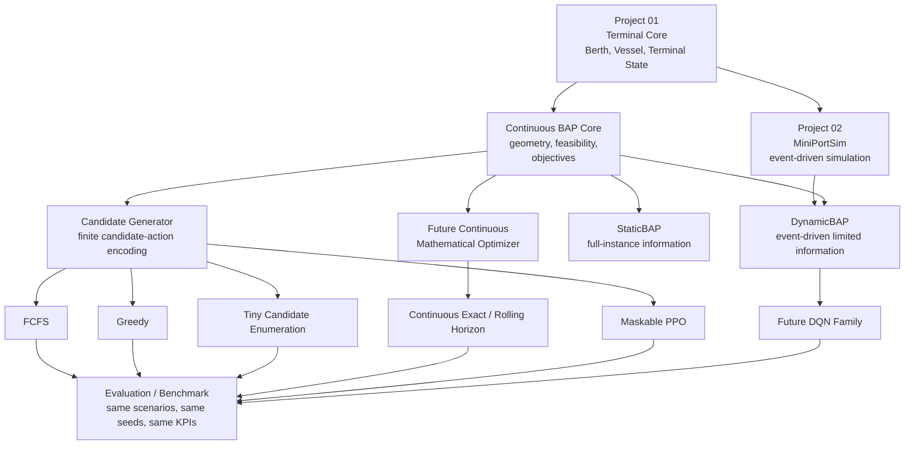

# Berth Allocation Lab Problem Specification

Status: frozen for Project 03 Step 1  
Scope: Project 03 - Berth Allocation Lab  
Primary objective: minimize total vessel waiting time

This document defines the berth-allocation problem family that Project 03 will
implement and benchmark. It is the engineering and research contract for the
later BAP core, baseline policies, exact solvers, reinforcement-learning
environments, and benchmark tooling.

Project 03 builds on:

- Project 01, `01-terminal-operations-core`, which defines the terminal domain
  entities and physical berth state.
- Project 02, `02-mini-port-simulation`, which defines event-driven simulation
  time, vessel arrivals, lifecycle handling, scenario seeds, metrics, and drain
  semantics.

Project 03 must not duplicate the simulator or redefine terminal physics. It
adds berth-allocation optimization and learning layers over the existing
domain/simulation foundation.

## Project Boundary

Project 03 concerns berth allocation only. Quay-crane, yard, relocation, truck,
and equipment scheduling behavior may exist in MiniPortSim, but they are treated
as fixed or exogenous when evaluating berth-allocation quality.

Project 03 v1 does not jointly optimize:

- quay-crane assignment or scheduling,
- yard allocation,
- container relocation,
- truck dispatch,
- terminal equipment scheduling.

The purpose of this boundary is to isolate the quality of berth-allocation
decisions before later projects add coupled berth, crane, and yard optimization.

## Repository Compatibility Findings

The specification follows these existing repository conventions:

- Distance is represented in meters.
- Core berth geometry uses `Berth.length_m`, `BerthOccupancy.start_position_m`,
  and `BerthOccupancy.end_position_m`.
- The canonical clearance field is `min_clearance_m`.
- `min_clearance_m` is a gap between neighboring occupied vessel intervals, not
  extra length added to the vessel itself.
- MiniPortSim simulation time is numeric elapsed minutes. `env.now` is the
  authoritative clock, and `Terminal.current_time` is synchronized from it.
- Synthetic scenario timestamps are simulation-relative minutes, with optional
  conversion to datetimes at the simulation boundary.
- Project 02 supports horizon and drain termination modes. Drain mode stops new
  arrivals at the nominal scenario duration and continues until open vessel work
  is resolved or a maximum drain extension is exceeded.
- Project 02's current baseline berth policy is FCFS with leftmost feasible
  continuous placement.

## Formulation Family

Project 03 uses the Continuous Berth Allocation Problem.

The quay is represented as a continuous one-dimensional spatial interval:

```text
[0, Q]
```

where:

```text
Q = total berth / quay length in meters
```

Each vessel `i` has at minimum:

```text
a_i = arrival / ETA time
L_i = vessel length in meters
h_i = service / handling duration in minutes
```

The berth-allocation decision determines:

```text
x_i = berthing start position along the quay, in meters
s_i = service / berthing start time, in minutes
c_i = s_i + h_i
```

where `c_i` is the completion or departure-ready time.

Waiting time:

```text
W_i = s_i - a_i
```

Turnaround time:

```text
T_i = c_i - a_i
```

The physical problem remains continuous even when an RL environment later
exposes a finite set of valid candidate positions. Continuous physical BAP does
not imply that the RL action representation must itself be continuous.

The intended terminology is:

```text
continuous berth geometry with finite candidate-action encoding
```

The finite candidate positions are an action-space engineering technique over a
continuous quay. They must not be described as converting the problem into
discrete BAP.

## Static and Dynamic Branches

Project 03 contains two separate problem branches.

### Static Continuous BAP (CSBAP)

In Static Continuous BAP, all vessel information required for the instance is
available when schedule construction begins.

```text
V = {V_1, ..., V_N}
```

The static environment may still construct the schedule sequentially. Static
does not mean "one action"; it means the complete instance is known before
scheduling starts.

### Dynamic Continuous BAP (CDBAP)

In Dynamic Continuous BAP, vessels appear over simulation time. The simulator may
internally know future events, but the agent may only observe information that
is legitimately exposed.

The dynamic environment distinguishes:

```text
s_t = full simulator state
o_t = agent observation
```

In DynamicBAP:

```text
o_t is a subset of s_t
```

because future information is limited by a configured visibility horizon and by
announcement/update events.

### Shared Core, Separate Environments

Static and Dynamic BAP must eventually use:

- separate environments,
- separate trained models,
- separate benchmark results.

They may share:

- continuous quay geometry,
- feasibility constraints,
- vessel/problem schemas,
- candidate-position generation,
- objective definitions,
- metric definitions,
- visualization and benchmark utilities.

The shared core defines physics and metrics. The static and dynamic environments
define information availability, decision timing, action representation, and
episode progression.

## Primary Objective

Project 03 v1 freezes the primary optimization objective as:

```text
minimize sum_i W_i
```

where:

```text
W_i = s_i - a_i
```

This is:

```text
Minimize Total Vessel Waiting Time.
```

Project 03 v1 does not optimize a weighted multi-objective expression such as:

```text
alpha * waiting + beta * turnaround + gamma * delay
```

Weighted multi-objective optimization is a future extension.

### Optimization Objective

The single v1 optimization objective is total vessel waiting time:

```text
TotalWaiting = sum_i W_i
```

### Benchmark KPIs

The following KPIs should eventually be reported even though they are not all
separate objectives:

- total waiting time,
- mean waiting time,
- P95 waiting time,
- mean turnaround time,
- P95 turnaround time,
- berth utilization,
- throughput / vessels served,
- algorithm runtime or decision latency where relevant.

If all runs contain the same number of fully resolved vessels:

```text
MeanWaiting = TotalWaiting / N
```

Therefore total waiting and mean waiting should not be treated as independent
optimization objectives for direct comparisons over identical vessel sets.

Also:

```text
Turnaround_i = Waiting_i + Service_i
```

Under fixed service times, minimizing waiting strongly aligns with minimizing
turnaround. This relationship may weaken in later integrated berth/crane models
where service duration can depend on downstream decisions.

## Units

Canonical internal units for Project 03 are:

| Quantity | Unit |
| --- | --- |
| distance | meters |
| vessel length | meters |
| berth position | meters |
| service duration | minutes |
| waiting time | minutes |
| turnaround time | minutes |
| simulation time | elapsed minutes from scenario start |
| synthetic timestamps | simulation-relative minutes |
| berth utilization | fraction in `[0, 1]` |

This matches Project 02's simulation convention, where `env.now` is elapsed
minutes. Reports may display hours for readability, but internal calculations
must not silently introduce an incompatible time unit.

## Minimum Clearance

The canonical field name is:

```text
min_clearance_m
```

Do not introduce `minimum_clearance_m` as a data field.

A vessel physically occupies exactly its hull/service interval:

```text
[x_i, x_i + L_i]
```

`min_clearance_m` is the required open distance between neighboring vessel
intervals. It is not counted inside `L_i`, and it is not added twice.

If vessel A is spatially left of vessel B, the required relation is:

```text
x_B >= x_A + L_A + min_clearance_m
```

Equivalently, the gap between A's end and B's start must be at least
`min_clearance_m`.

Boundary handling is separate:

```text
0 <= x_i
x_i + L_i <= Q
```

No extra clearance is required between a vessel and the quay origin or quay end
in v1 unless a later scenario explicitly introduces berth-end safety buffers.

Example:

```text
Q = 500 m
min_clearance_m = 20 m
A: x_A = 0, L_A = 180, occupied interval [0, 180]

B may start at x_B = 200, because 200 - 180 = 20.
B may not start at x_B = 195, because 195 - 180 = 15.
```

## Physical Feasibility Constraints

Every solver, heuristic, and RL action must satisfy the same physical
feasibility rules.

### Arrival Constraint

A vessel cannot start service before arrival:

```text
s_i >= a_i
```

### Quay Boundary Constraint

A vessel must lie inside the continuous quay:

```text
0 <= x_i
x_i + L_i <= Q
```

Clearance between vessels is handled by pairwise spacing constraints, not by
shrinking the quay or inflating each vessel at the quay boundary.

### Spatial-Temporal Non-Overlap

Two vessels `i` and `j` cannot occupy overlapping berth space while their
service intervals overlap.

For every pair `i, j`, at least one of the following must hold:

```text
c_i <= s_j
c_j <= s_i
x_i + L_i + min_clearance_m <= x_j
x_j + L_j + min_clearance_m <= x_i
```

This is a disjunctive feasibility definition. It intentionally does not lock the
project into a specific MILP, CP-SAT, or search linearization. Exact-solver
formulation belongs to a later step.

### Vessel Uniqueness

Each vessel may receive at most one active placement in a schedule.

### Lifecycle Consistency

In dynamic simulation, a vessel cannot be simultaneously waiting and berthed.
Completed or departed vessels cannot return to waiting.

## Space-Time Representation

A scheduled vessel is represented conceptually as a rectangle in a quay-time
plane.

- Horizontal dimension: vessel length in meters, with clearance enforced
  between neighboring rectangles when their time intervals overlap.
- Vertical dimension: service duration in minutes.

A feasible BAP schedule is a non-overlapping packing of vessel service
rectangles inside the quay-time domain.

```text
time
 ^
 |
 |         +-------------------+
 |         | vessel B          |
 |         | x_B..x_B+L_B      |
 |         +-------------------+
 |
 | +---------------+       +----------------+
 | | vessel A      |       | vessel C       |
 | | x_A..x_A+L_A  |       | x_C..x_C+L_C   |
 | +---------------+       +----------------+
 |
 +--------------------------------------------------> quay position
   0                                                Q
```

If A and C overlap in time, their horizontal intervals must be separated by at
least `min_clearance_m`. If A departs before B begins, A and B may reuse the
same physical berth segment at different times.

## Candidate Berth Positions

RL v1 will use a finite candidate-action representation over the continuous
quay. The candidate set must be generated from meaningful geometric locations
rather than arbitrary one-meter discretization.

Potential candidate sources include:

- the quay origin,
- beginnings of feasible free segments,
- positions immediately after an occupied or scheduled vessel plus
  `min_clearance_m`,
- boundary-induced feasible placements.

The invariant is:

```text
Candidate generation must not redefine the physical problem as discrete berth
allocation.
```

Future candidate-generator requirements:

- deterministic for identical state and configuration,
- no invalid positions,
- no duplicates after numeric tolerance handling,
- stable ordering,
- compatible with action masking,
- independently unit-testable,
- shared by finite-candidate methods such as FCFS, greedy, RL action
  generation, RL action masks, and tiny candidate-space enumeration where
  appropriate.

Candidate generation must be a BAP core component, not policy-specific hidden
logic. It must not constrain a future true continuous mathematical optimizer.
The physical BAP remains continuous, and a future continuous-BAP reference may
optimize berth positions outside the finite candidate set.

## StaticBAP V1 Definition

StaticBAP v1 schedules a known vessel set sequentially.

### Static Input

The static instance contains:

- quay length `Q`,
- `min_clearance_m`,
- vessel IDs,
- arrival times `a_i`,
- vessel lengths `L_i`,
- service durations `h_i`,
- optional metadata such as priority or preferred position for future versions.

All vessels are known from the beginning.

### Static Scheduling Order

For v1, the environment determines the vessel scheduling order using a
deterministic ETA/arrival-based ordering. Ties should be broken deterministically
by stable vessel ID unless Step 7 chooses a more precise equivalent.

The agent does not choose the vessel in StaticBAP v1.

Future versions may expand the action to:

```text
a_k = (vessel_i, position_j)
```

allowing the agent to select both which vessel and where to place it. That is
not required in v1.

### Static Action

For the current vessel in the deterministic construction order, the v1 action is
primarily:

```text
a_k = candidate berth position
```

The environment determines the earliest feasible service start at that selected
position:

```text
s_i = earliestFeasibleStart(i, x_i)
```

The v1 learning problem focuses on spatial placement before joint vessel/space
selection.

### Static Observation Intent

The agent has access to:

- all vessel input information,
- quay geometry,
- the partial schedule already constructed,
- the current vessel being placed.

The exact tensor or dictionary encoding belongs to the environment
implementation phase.

### Static Decision Point

There is one decision after each schedule-construction step. StaticBAP v1 does
not require a physical minute-by-minute clock.

### Static Reward Intent

The intended simple reward for v1 is:

```text
r_k = -W_i
```

for the newly scheduled vessel. Exact reward encoding belongs to the
environment implementation step.

### Static Episode Termination

The episode ends when all vessels have been successfully scheduled.

## DynamicBAP V1 Definition

DynamicBAP is the long-term operational target. It uses event-driven simulation
time from MiniPortSim and exposes only currently available information to the
agent.

### Dynamic Observation Intent

A conceptual observation contains:

- current simulation time,
- currently berthed vessels,
- remaining service information,
- berth occupancy / free segments,
- waiting vessels,
- known future vessels inside the configured planning horizon.

Conceptually:

```text
o_t = {
  currentTime,
  berthState,
  waitingVessels,
  knownFuture^H
}
```

Project 03 does not yet freeze a final neural tensor shape. The tensor encoding
belongs to the environment implementation phase.

### Limited Future Horizon

DynamicBAP supports limited future information:

```text
H = future visibility / planning horizon
```

The initial intended experiment is likely:

```text
H = 4 hours = 240 minutes
```

but `H` must be configurable. Future experiments may compare:

```text
H = 0, 2h, 4h, 8h
```

A vessel becomes visible to the agent when it enters the observation horizon or
when an equivalent announcement/forecast event occurs.

The simulator's internal future event knowledge must not leak into the agent
observation outside the configured horizon. This is required to avoid
unrealistic clairvoyant RL policies.

### Dynamic Action Space

DynamicBAP v1 action space is conceptually:

```text
a_t = (waiting vessel, candidate berth position)
```

plus:

```text
WAIT
```

An assignment action means:

```text
berth this currently waiting vessel now at this valid candidate location
```

For v1, the agent does not make explicit future berth reservations such as
"berth vessel A at 16:30 at x = 400." The future horizon informs current online
decisions; it does not permit arbitrary future reservation actions in v1.

### WAIT Action

`WAIT` is a deliberate operational action. The agent is not forced to berth a
vessel merely because a feasible placement currently exists.

`WAIT` allows intentional idling when preserving quay geometry for an expected
future vessel may reduce total future waiting cost.

`WAIT` must only be exposed to the agent when both conditions hold:

- at least one vessel is waiting,
- at least one feasible berth assignment currently exists.

If no vessel is waiting, or if vessels are waiting but no feasible assignment
exists, the agent should not be asked to choose `WAIT`. The environment should
automatically advance simulation time to the next meaningful event instead.

This distinction is mandatory:

- intentional policy `WAIT`: the agent deliberately chooses not to use an
  available feasible assignment,
- automatic environment advancement: the environment moves time forward because
  there is no useful decision for the agent to make.

The environment must prevent pathological behavior where `WAIT` can be selected
forever without time progressing. A `WAIT` action must advance simulation to the
next meaningful future event, such as:

- vessel arrival,
- berth release / service completion,
- future-vessel horizon entry,
- material ETA or information update if supported.

If no future event can occur and vessels remain waiting, the environment must
not silently treat infinite waiting as success. That condition is an error or an
unresolved episode outcome to be reported by evaluation.

### Action Masking

Project 03's first intended RL algorithm is Maskable PPO. Environments must
eventually expose valid-action masks.

Conceptually invalid actions include:

- vessel does not fit inside quay boundaries,
- candidate position overlaps an occupied berth segment,
- `min_clearance_m` is violated,
- vessel is not currently eligible/waiting,
- candidate is duplicate or otherwise infeasible,
- `WAIT` is requested when no feasible assignment exists,
- `WAIT` would fail to advance to a meaningful future event.

The agent should not need to learn obvious physical impossibility through large
negative rewards. Physical constraints should primarily be enforced through
feasibility checks and action masks.

Masked actions must never modify simulation state.

### Dynamic Decision Points

DynamicBAP v1 is event-driven. It does not use fixed one-minute control ticks.

Core principle:

```text
Call the agent when meaningful information or feasible decisions change.
```

Conceptual decision events:

- Vessel arrival: a vessel physically arrives and becomes eligible/waiting.
- Berth release / service completion: a vessel leaves and quay capacity
  changes.
- Future-vessel announcement / horizon entry: a future vessel becomes visible
  inside `H`.
- Material ETA / information update: meaningful forecast changes may cause a
  future decision point if supported later.
- Post-assignment decision: after the agent berths a vessel, recompute feasible
  actions at the same simulation timestamp.

One simulation event is not necessarily one RL action. At the same simulation
timestamp the agent may produce:

```text
a_1, a_2, ..., a_k
```

until no useful feasible assignment remains or the agent selects `WAIT`.

If no feasible assignment exists, the environment advances automatically rather
than asking the agent to select `WAIT`.

The agent must not be called every minute simply because time has passed.

### Dynamic Reward

The primary objective and RL reward must remain mathematically aligned.

For event-driven DynamicBAP, the conceptual accumulated waiting cost is:

```text
r_k = -Q_k * Delta_t
```

where:

```text
Q_k = number of waiting vessels during the interval
Delta_t = tau_{k+1} - tau_k
```

Then:

```text
-sum_k Q_k * Delta_t
```

corresponds to accumulated total vessel waiting time.

Under the appropriate queue interpretation:

```text
TotalWaiting = integral Q(t) dt
```

The v1 reward should not add arbitrary queue-length penalties, throughput
bonuses, turnaround penalties, or utilization bonuses. Reward engineering
extensions belong to later versions.

### Dynamic Episode Termination

DynamicBAP termination must prevent policies from appearing good by leaving
difficult vessels unresolved.

The intended normal completion rule is:

1. scenario stops generating new arrivals,
2. the system continues draining,
3. all generated vessels are resolved/serviced,
4. only then is the episode complete.

This aligns with Project 02's drain concept. If a safety limit such as maximum
drain extension is reached, unresolved vessels must be reported explicitly in
the evaluation and must not be counted as a clean completed episode.

## Exact Optimizer Role

Project 03 Step 1 does not implement an exact solver.

Project 03 must distinguish two reference concepts:

- Candidate-space oracle: tiny brute force or enumeration over the finite
  candidate representation. This is useful for candidate-generator validation,
  implementation debugging, and tiny-instance correctness checks.
- True continuous-BAP mathematical reference: a future exact or high-quality
  solver that may optimize continuous berth positions independently of the RL
  candidate-action set.

A candidate-space oracle must not be labeled a continuous optimum unless a later
proof establishes equivalence for a specific instance class.

The future exact or high-quality mathematical optimizer is intended mainly for:

- small deterministic static instances,
- validation,
- oracle/reference quality,
- benchmarking heuristics and RL.

For a minimization problem:

```text
J* <= J_policy
```

When an optimal reference `J*` is available:

```text
OptimalityGap = (J_policy - J*) / J*
```

If `J* = 0`, gap reporting must avoid division by zero and should use an
explicit special-case convention.

The exact solver is not assumed to scale to all large dynamic cases.

For DynamicBAP, later benchmarks should distinguish:

- Clairvoyant oracle: may know the complete future. This is an
  upper-performance reference, not a fair deployable competitor.
- Rolling-horizon optimizer: receives approximately the same future information
  horizon as the RL agent. This is a fairer operational comparison.

Neither is implemented in Step 1.

## First RL Algorithm

The initial RL algorithm choice is:

```text
Maskable PPO
```

The v1 research/engineering question is not "which RL algorithm is globally
best?" It is:

```text
Can a correctly constructed BAP environment support learning of a meaningful
berth-allocation policy?
```

Future comparison families may include:

- DQN,
- Double DQN,
- Dueling DQN,
- D3QN or related variants.

These are not implemented in Step 1.

## Versioning Convention

Future model and benchmark names should combine:

- formulation,
- algorithm or policy family,
- version.

Examples:

```text
static_maskppo_v1
dynamic_maskppo_v1
dynamic_dqn_v1
dynamic_dueling_ddqn_v1
```

Avoid ambiguous names such as:

```text
model_v1
model_final
```

The same principle should apply to benchmark, config, and scenario-family
versions.

## Benchmark Principles

Policies must be compared on the same scenario instances and seeds.

For example:

```text
scenario = heavy_01
seed = 8472
```

should be evaluated with:

- FCFS,
- Greedy,
- Exact when applicable,
- PPO,
- future algorithms.

Each policy must not receive a different randomly generated workload when making
direct comparisons. This preserves common-random-number comparison logic.

Primary benchmark metrics:

- total waiting time,
- mean waiting time,
- P95 waiting time,
- mean turnaround time,
- P95 turnaround time,
- berth utilization,
- throughput / vessels served,
- algorithm runtime or decision latency where relevant.

Static exact benchmarks should also support optimality gap.

## Data Source Position

Project 03 initially works with reproducible synthetic scenarios.

The data progression is:

```text
synthetic scenarios
-> AIS-calibrated synthetic scenarios
-> partner / terminal-calibrated scenarios when operational data exists
```

AIS should primarily be treated as a future source of:

- vessel arrival patterns,
- vessel mix,
- vessel dimensions,
- traffic intensity,
- trajectory / port-call information,
- ETA / arrival variability.

AIS alone does not contain all operational BAP inputs, such as crane
productivity, workload, TOS decisions, yard congestion, or actual causes of
service delay.

Project 03 must function without Project 07/AIS.

## V1 Non-Goals

Project 03 v1 explicitly does not include:

- joint berth + crane optimization,
- joint berth + yard optimization,
- multi-agent RL,
- continuous-action RL for exact meter coordinates,
- advance berth reservation in DynamicBAP,
- multi-objective reward optimization,
- learned service-time prediction,
- AIS ingestion pipeline,
- real terminal TOS integration,
- weather, tide, or draft constraints unless they become essential in the
  existing simulator,
- sophisticated stochastic / robust optimization,
- testing every RL algorithm,
- replacing MiniPortSim with a second simulation engine.

## Frozen Assumptions

These decisions are accepted for Project 03 v1:

- The physical berth is continuous and one-dimensional.
- The canonical clearance field is `min_clearance_m`.
- Clearance is enforced once as the open gap between neighboring vessel
  intervals.
- The internal Project 03 time unit is elapsed minutes.
- The primary objective is total vessel waiting time.
- StaticBAP and DynamicBAP are separate branches with shared physical core
  logic.
- StaticBAP v1 uses deterministic arrival/ETA-based vessel ordering.
- StaticBAP v1 action selects a candidate berth position for the current vessel.
- DynamicBAP v1 action selects an eligible waiting vessel and a valid candidate
  position, or `WAIT`.
- DynamicBAP v1 is event-driven rather than tick-driven.
- DynamicBAP observations must not expose future information outside `H`.
- Initial RL algorithm family is Maskable PPO.
- Synthetic scenarios are the initial data source.

## Open Questions / Future Decisions

These are intentionally unresolved implementation choices:

- exact candidate-position generation algorithm,
- numeric tolerance for candidate de-duplication and geometry comparisons,
- final observation tensor/dictionary encoding,
- maximum number of vessels represented in neural observations,
- variable-size observation handling,
- exact static tie-breaking rule beyond stable vessel ID,
- exact PPO hyperparameters,
- exact exact-solver formulation,
- final default `H` value,
- ETA uncertainty model,
- handling service-time uncertainty,
- dynamic ETA update semantics,
- whether detailed crane/yard service effects are disabled, fixed, or
  abstracted for each benchmark family,
- report storage format for raw event/vessel/run records.

## System Invariants

The following invariants should later become tests:

- No vessel starts before arrival.
- No vessel lies outside quay bounds.
- Overlapping service intervals cannot overlap spatially.
- `min_clearance_m` is always respected.
- `min_clearance_m` is not double-counted.
- Completed vessels cannot re-enter waiting state.
- A vessel cannot be simultaneously waiting and berthed.
- A dynamic action can only assign an eligible waiting vessel.
- Masked actions must never modify simulation state.
- The same state and configuration must produce deterministic candidate
  ordering.
- Future information outside `H` must not appear in DynamicBAP observation.
- Simulation time must never move backwards.
- `WAIT` must eventually move simulation to a future meaningful event.
- Every generated vessel must have a terminal lifecycle outcome by normal
  episode completion.
- Every benchmark run records scenario ID, seed, formulation, policy, and
  objective/KPI outputs.

## Worked Examples

### Example A - Static Continuous Placement

Inputs:

```text
Q = 500 m
min_clearance_m = 20 m

Vessel A: arrival 0,   length 180 m, service 120 min
Vessel B: arrival 30,  length 140 m, service 90 min
Vessel C: arrival 40,  length 260 m, service 150 min
```

StaticBAP v1 orders vessels by arrival: A, B, C.

Step 1 places A. Candidate `x_A = 0` is feasible:

```text
s_A = earliestFeasibleStart(A, 0) = 0
c_A = 120
W_A = 0
```

Step 2 places B. Candidate `x_B = 200` is feasible next to A because:

```text
200 >= 0 + 180 + 20
```

B has arrived by minute 30:

```text
s_B = 30
c_B = 120
W_B = 0
```

Step 3 places C. Candidate `x_C = 0` overlaps spatially with A and B during
their active intervals, so its earliest feasible start is after both leave:

```text
s_C = 120
c_C = 270
W_C = 120 - 40 = 80
```

The environment computes the earliest feasible start for the selected position;
the v1 static agent chooses the position.

### Example B - Dynamic Arrival and Berth Release

Event-driven decision timeline:

```text
08:00  Vessel A arrives
       -> decision point
       -> agent assigns A at x = 0

09:15  Vessel B arrives
       -> decision point
       -> no feasible placement or agent selects WAIT

11:30  Vessel A completes and berth space is released
       -> decision point
       -> agent assigns B
```

Decisions occur because arrivals and berth releases changed the set of feasible
actions. The agent is not called at 08:01, 08:02, and every other minute merely
because time passed.

### Example C - Intentional WAIT

Inputs at time 10:00:

```text
Q = 400 m
min_clearance_m = 20 m

Waiting vessel S: length 120 m
Known future vessel L: arrives 10:20, length 280 m
```

If S berths immediately at `x = 140`, it may split the quay into unusable
fragments for L:

```text
left free: 0..140
S occupies: 140..260
right free: 260..400
```

Neither side can fit L with required boundary constraints. A `WAIT` action may
be useful if L's imminent arrival has high future waiting impact or if S can be
placed later without blocking L.

This example does not prove WAIT is always optimal. It explains why WAIT must
exist as a legal dynamic action and why it must advance to the next meaningful
event rather than becoming a no-op loop.

## Architecture Diagram



Policies and algorithms consume shared physical rules. They do not redefine
berth geometry or feasibility.

## Traceability Table

| Specification item | Planned implementation step |
| --- | --- |
| Problem specification | Step 1 |
| Vessel/problem schema | Step 2 |
| Experiment/data contract | Step 2 |
| Synthetic scenario generator | Step 3 |
| Continuous BAP geometry | Step 4 |
| Feasibility constraints | Step 4 |
| Candidate positions | Step 4 |
| FCFS / Greedy baselines | Step 5 |
| Static exact solver | Step 6 |
| StaticBAPEnv | Step 7 |
| Static Maskable PPO | Step 8 |
| DynamicBAPEnv | Step 9 |
| Dynamic Maskable PPO | Step 10 |
| Scientific benchmark suite | Step 11 |
| Results warehouse / reporting | Step 12 |
